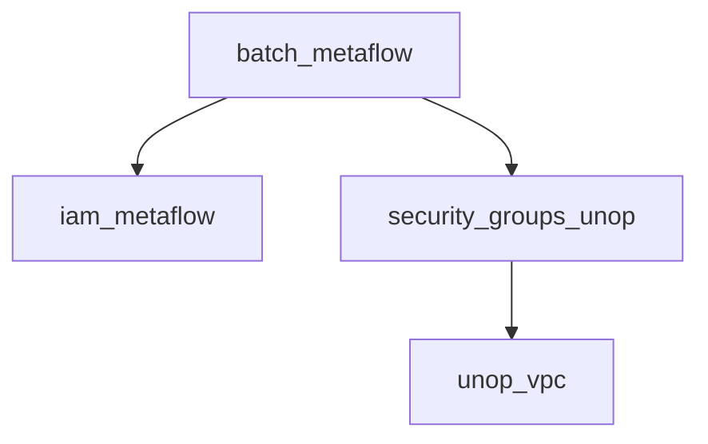

# Terraform Providers and Module Dependencies

## Overview
This document centralizes version requirements and dependency information for all AWS infrastructure modules in the mono-repo.

## Module Specifications

### iam_metaflow
**Purpose**: IAM roles and policies for Metaflow on AWS Batch

**Version Requirements**:
- Terraform: >= 1.13.0
- AWS Provider: >= 6.0

**Wrapped Public Module**:
- Source: `terraform-aws-modules/iam/aws`
- Version: ~> 6.1.0

**Key Features**:
- Creates execution and task roles
- Configurable policy attachments
- Tagging support

**Dependencies**:
- None

---

### s3_metaflow
**Purpose**: Secure S3 bucket for Metaflow datastore

**Version Requirements**:
- Terraform: >= 1.13.0
- AWS Provider: >= 6.0

**Wrapped Public Module**:
- Source: `terraform-aws-modules/s3-bucket/aws`
- Version: ~> 5.4.0

**Key Features**:
- Server-side encryption
- Versioning
- Access logging

**Dependencies**:
- None

---

### vpc_metaflow
**Purpose**: VPC foundation for Metaflow

**Version Requirements**:
- Terraform: >= 1.13.0
- AWS Provider: >= 6.0

**Wrapped Public Module**:
- Source: `terraform-aws-modules/vpc/aws`
- Version: ~> 6.0.0

**Key Features**:
- Single AZ deployment
- Gateway endpoints (S3, DynamoDB)
- No NAT gateway

**Dependencies**:
- None

---

### batch_metaflow
**Purpose**: AWS Batch compute environments for Metaflow

**Version Requirements**:
- Terraform: >= 1.5.7
- AWS Provider: 6.10.0 (pinned)

**Wrapped Public Module**:
- Source: `terraform-aws-modules/batch/aws`
- Version: v3.0.4 (Git reference)

**Key Features**:
- On-demand and spot instances
- GPU support
- Job queues

**Dependencies**:
- iam_metaflow (for execution roles)
- security_groups_unop

---

### ecr_unop
**Purpose**: ECR repositories for Metaflow

**Version Requirements**:
- Terraform: >= 1.13.0
- AWS Provider: >= 6.0

**Wrapped Public Module**:
- Source: `terraform-aws-modules/ecr/aws`
- Version: 3.0.1

**Key Features**:
- Lifecycle policies
- Configurable access
- Tag mutability

**Dependencies**:
- None

---

### security_groups_unop
**Purpose**: Security groups for Metaflow components

**Version Requirements**:
- Terraform: >= 1.13.0
- AWS Provider: >= 6.0

**Wrapped Public Module**:
- Source: `terraform-aws-modules/security-group/aws`
- Version: 5.3.0

**Key Features**:
- Configurable rules
- VPC-specific
- Standardized interface

**Dependencies**:
- unop_vpc (for VPC ID)

## Usage Examples

### Basic Module Reference
```hcl
module "vpc" {
  source = "../../unop_vpc"

  # Required parameters
  cidr = "10.0.0.0/16"

  # Optional overrides
  enable_nat_gateway = false
}
```

### Module Composition Example
```hcl
module "batch" {
  source = "../../metaflow_batch"

  # Dependencies from other modules
  execution_role_arn = module.iam.metaflow_batch_role_arn
  security_group_ids = [module.sg.batch_security_group_id]
}

## Upgrade Procedures

1. **Pre-Upgrade Checklist**:
   - Review all module changelogs
   - Test in non-production environment
   - Document rollback procedure

2. **Version Bump Process**:
   ```bash
   # For patch version updates (~>)
   terraform get -update

   # For major version updates
   # 1. Update versions.tf
   # 2. Run terraform init -upgrade
   # 3. Validate with terraform plan
   ```

3. **Breaking Change Protocol**:
   - Maintain both versions temporarily
   - Use feature flags for gradual rollout
   - Update documentation before removal

4. **Post-Upgrade Validation**:
   - Run all module tests
   - Verify integration points
   - Update this document with new versions

## Version Requirements Matrix

| Module | Terraform | AWS Provider | Public Module Version |
|--------|-----------|--------------|-----------------------|
| iam_metaflow | >= 1.13.0 | >= 6.0 | ~> 6.1.0 |
| s3_metaflow | >= 1.13.0 | >= 6.0 | ~> 5.4.0 |
| vpc_metaflow | >= 1.13.0 | >= 6.0 | ~> 6.0.0 |
| batch_metaflow | >= 1.5.7 | = 6.10.0 | v3.0.4 (Git) |
| ecr_unop | >= 1.13.0 | >= 6.0 | 3.0.1 |
| security_groups_unop | >= 1.13.0 | >= 6.0 | 5.3.0 |

## Module Dependency Graph



Key:
- Solid arrows indicate hard dependencies
- Dotted arrows indicate optional integrations

## Version Locking Policy

| Version Range | Update Policy |
|---------------|---------------|
| `~> X.Y.Z`    | Auto-update patch versions |
| `>= X.Y`      | Manual review required |
| Pinned (`X.Y.Z`) | Critical - requires testing |

## Upgrade Checklist
1. Review changelogs for all modules
2. Test in staging environment
3. Verify backward compatibility
4. Update version constraints
5. Update this document
