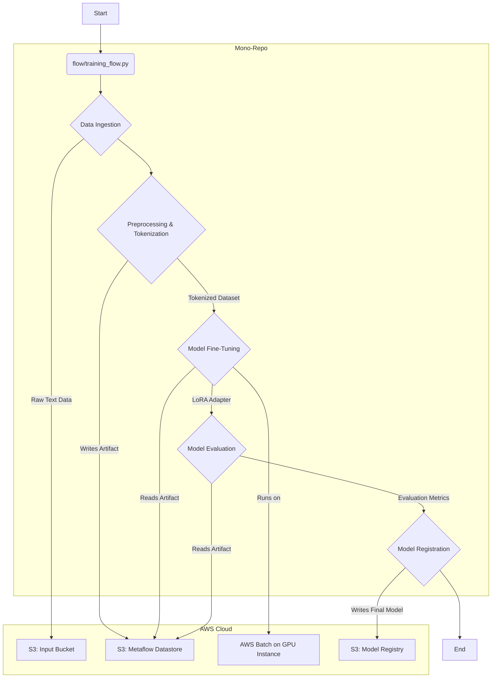

# Qwen Infrastructure - System Architecture Document

## Overview
This document outlines the architecture and process for fine-tuning a Qwen-0.5B model using Parameter-Efficient Fine-Tuning (PEFT) with LoRA. The entire workflow is orchestrated by Metaflow and leverages the AWS infrastructure defined in this directory, all within the existing mono-repo structure.

**Declarative Goal:** Fine-tune a Qwen-0.5B model with LoRA on a perplexity-based loss curve using a custom text dataset. The process should be automated, reproducible, and integrated into the mono-repo's tooling.

### Core Assumptions
1.  **Model Source**: The base Qwen-0.5B model is publicly available from the Hugging Face Hub.
2.  **Data Source**: The training dataset (plain text) is located in a pre-determined S3 bucket, accessible by the Metaflow job role.
3.  **Dependencies**: All necessary Python libraries (`transformers`, `peft`, `datasets`, `bitsandbytes`, `metaflow`) are managed by Pants within the mono-repo.
4.  **Infrastructure**: The Terraform-provisioned AWS infrastructure is active. The Metaflow client is configured to use the correct job queue and S3 datastore.
5.  **Container**: A base container image with CUDA, Python, and other system-level dependencies is available in ECR. Metaflow will add Python package dependencies on top of this during the run.

## Process Flow: A Petri Net Perspective
This workflow is modeled as a Directed Acyclic Graph (DAG) executed by Metaflow. Each step is a transition that consumes artifacts and produces new ones, with data flowing through the S3 datastore like tokens in a Petri net.

## Component Breakdown & Data Movement

### 1. Data Ingestion & Preprocessing
-   **Location**: `packages/qwen_ft/src/flows/training_flow.py`
-   **Trigger**: Manual execution of the Metaflow script: `python -m packages.qwen_ft.src.flows.training_flow run`.
-   **Action**:
    1.  The `start` step in the Metaflow flow is executed locally.
    2.  It uses `boto3` to fetch the raw text data from the designated input S3 bucket.
    3.  A subsequent step, also running locally, uses the Hugging Face `datasets` library to load the text data.
    4.  The Qwen tokenizer is loaded from the Hub. The dataset is tokenized, formatted, and split into training and validation sets.
-   **Output**: The tokenized dataset is saved as a Metaflow artifact. Metaflow automatically versions this artifact and stores it in its S3 datastore (`s3://<your-metaflow-s3-bucket-name>/training_flow/...`).

### 2. Model Fine-Tuning (PEFT with LoRA)
-   **Location**: A `@batch` step within `training_flow.py`, decorated with `@resources(gpu=1)`.
-   **Action**:
    1.  Metaflow submits this step as a job to the AWS Batch GPU-enabled job queue.
    2.  The job, running on a `g5.xlarge` or similar instance, begins execution.
    3.  It loads the tokenized dataset artifact from the Metaflow S3 datastore.
    4.  It downloads the base Qwen-0.5B model from the Hugging Face Hub in 4-bit precision using `bitsandbytes` for memory efficiency.
    5.  A LoRA `PeftConfig` is defined, targeting the model's attention blocks.
    6.  The `transformers.Trainer` is initialized with the model, datasets, and a custom callback to compute and log perplexity at each evaluation step.
    7.  `trainer.train()` is called. The `Trainer` handles the training loop, gradient updates, and checkpointing (checkpoints are stored temporarily on the Batch instance's local disk).
-   **Output**: Upon completion, the final trained LoRA adapter weights (a small set of files, not the full model) are saved as a Metaflow artifact to the S3 datastore.

### 3. Model Evaluation
-   **Location**: Another `@batch` step in `training_flow.py`.
-   **Action**:
    1.  This job loads the base Qwen model again.
    2.  It loads the trained LoRA adapter artifact from the previous step.
    3.  The adapter is applied to the base model using `model.add_adapter()`.
    4.  The `trainer.evaluate()` method is called on the hold-out test set.
-   **Output**: A dictionary of final evaluation metrics (including perplexity) is saved as a Metaflow artifact to the S3 datastore.

### 4. Model Registration
-   **Location**: The `end` step in `training_flow.py`.
-   **Action**:
    1.  This step runs locally after all parallel branches have completed.
    2.  It accesses the evaluation metrics and the LoRA adapter artifacts from the successful run.
    3.  It performs a quality check (e.g., `if metrics['perplexity'] < threshold:`).
    4.  If the check passes, it copies the LoRA adapter files from the Metaflow datastore to a permanent, versioned location in a dedicated "model registry" S3 bucket (e.g., `s3://qwen-model-registry/qwen-0.5b-lora/v1.0/`).
    5.  It adds a `production` tag to the successful Metaflow run for easy identification: `metaflow.current.run.add_tag('production')`.
-   **Output**: A registered, production-ready LoRA adapter in a well-known S3 location.

## Interfaces
- **Terraform Variables**
- **Output Values**
- **Cross-stack Dependencies**

## Deployment
*Deployment process and considerations*

## Version History
